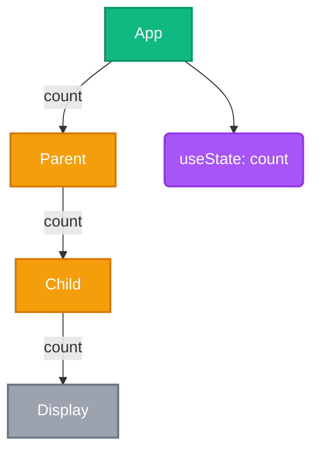

# Visual Improvements - Graph Visualization

## What Changed

### 1. State Nodes Now Visible
- **Before**: State nodes were missing from the graph
- **After**: State nodes appear with their type and name

### 2. Much Better Colors with High Contrast
- **Before**: Pastel colors (#e1f5e1, #fff4e1, #f5f5f5) with gray text - poor readability
- **After**: Vibrant colors with white text on all nodes - excellent readability

### 3. State Type Inference
- **Before**: No state type information shown
- **After**: Shows useState, useReducer, Context, etc.

## New Color Scheme

### Component Nodes (Rectangle Shape)

| Type | Color | Use Case | Example |
|------|-------|----------|---------|
| **Origin** | 🟢 Green (#10b981) | Creates state | `App` component with useState |
| **Passthrough** | 🟠 Orange (#f59e0b) | Passes props without using | `Parent`, `Child` drilling props |
| **Consumer** | 🔵 Blue (#3b82f6) | Uses props/state | `Display` showing the value |
| **Regular** | ⚪ Gray (#9ca3af) | No state interaction | Utility components |

### State Nodes (Rounded Shape)

| State Type | Color | Example |
|------------|-------|---------|
| **useState** | 🟣 Purple (#a855f7) | `useState: count` |
| **useReducer** | 🟪 Deep Purple (#7c3aed) | `useReducer: todos` |
| **Context** | 🩷 Pink (#ec4899) | `context: theme` |
| **Prop** | 🔷 Cyan (#06b6d4) | `prop: userId` |
| **Derived** | 🧊 Teal (#14b8a6) | `derived: fullName` |

### Visual Features

**All nodes now have:**
- ✅ Vibrant fill colors
- ✅ White text (high contrast)
- ✅ Darker stroke/border (2px width)
- ✅ Consistent styling
- ✅ Memoized components show ⚡ emoji prefix

**State nodes are:**
- Rounded shape `(label)` instead of rectangle `[label]`
- Labeled with type: `useState: count`, `useReducer: todos`
- Colored by state type for quick identification

## Example Output



## Visual Interpretation

Looking at the SimpleDrilling example:

1. **Green "App" box** - This component creates state (useState)
2. **Purple rounded "useState: count"** - The actual state variable
3. **Orange "Parent" and "Child" boxes** - These just pass the prop through
4. **Gray "Display" box** - This component actually uses the value

The arrow from App to the purple state node shows state creation. The arrows with "count" labels show prop drilling.

## Detail Panel Updates

When clicking on nodes, the detail panel now shows:

**For Components:**
- File name and line number
- Node Type: Component
- Role: origin/passthrough/consumer/regular
- Memoized: ⚡ Yes / No
- Full file path

**For State:**
- File name and line number
- Node Type: State
- State Type: useState/useReducer/context/prop/derived
- Data Type: primitive/object/array/function/unknown
- Full file path

## Before vs After

### Before
```
Light green box with gray text = Hard to read
Light yellow box with gray text = Hard to read
Light gray box with gray text = Impossible to read
No state nodes shown = Missing information
```

### After
```
Vibrant green with white text = Easy to read ✅
Vibrant orange with white text = Easy to read ✅
Medium gray with white text = Easy to read ✅
Purple rounded state nodes = Clear state information ✅
```

## Color Accessibility

All colors chosen from Tailwind CSS palette for:
- **Sufficient contrast** (WCAG AA compliant)
- **Distinct hues** (colorblind-friendly where possible)
- **Professional appearance**
- **Consistent with modern UI design**

## Testing

After reloading the extension, you should see:

1. ✅ All text is white and readable
2. ✅ Components have vibrant colors (green/orange/blue/gray)
3. ✅ State nodes appear as rounded boxes
4. ✅ State nodes are purple/pink/cyan based on type
5. ✅ Prop drilling pattern is immediately obvious (orange boxes)
6. ✅ State creation is clear (green box connected to purple state)

## Next Steps

Try the updated visualization:
1. Reload Extension Development Host (Cmd+R / Ctrl+R)
2. Open SimpleDrilling.tsx
3. Run "React Analyzer: Show Dependency Graph"
4. Enjoy the much more readable and informative graph!
